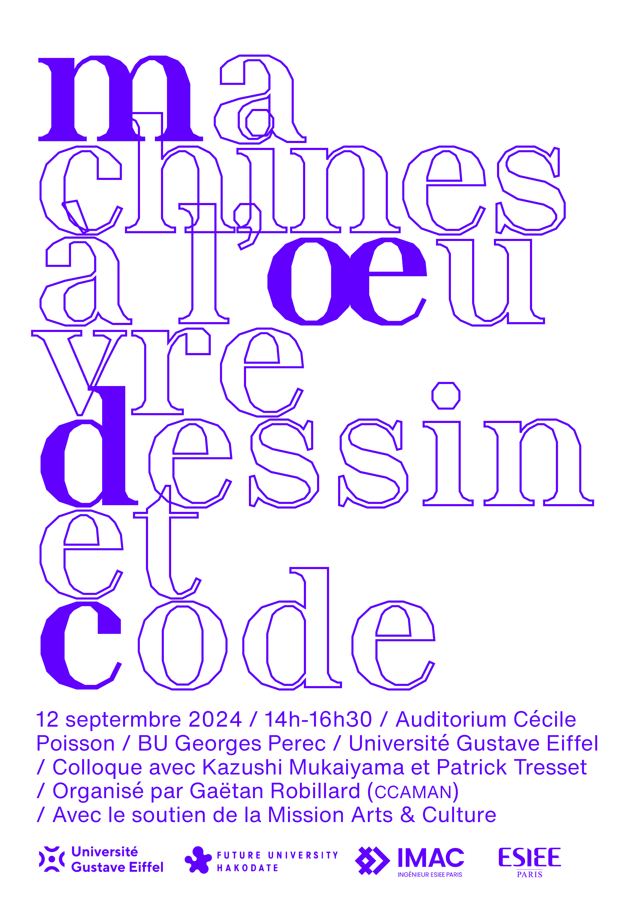

# Machines à l'œuvre. Dessin et code

Jeudi 12 septembre, 14h-16h30. Auditorium Cécile Poisson, B.U. George Perec Université Gustave Eiffel.

Adossé à l'exposition *Machine à l'œuvre* organisée à l'Université Gustave Eiffel en octobre 2024, ce colloque portera sur les rapports entre dessin, code et IA. D'un point de vue graphique, la ligne est un élément prépondérant de l'esthétique générative proposée par Max Bense, Vera Molnár ou Frieder Nake, dans l'Europe des années soixante. Comment à l'époque de l'IA générative cette réflexion évolue-t-elle, en particulier face aux modèles d'apprentissage profond (*deep learning*) ? Quelles nouvelles logiques et quelles pratiques sont en jeu ? Quelles en sont les limites ? Le colloque articulera ces questions par la présentation des artistes et chercheurs Patrick Tresset et Kazushi Mukaiyama. Puis, nous ouvrirons sur une table ronde, afin de revenir sur l'histoire ou sur les avancées de l'informatique créative.

Colloque organisé par Gaëtan Robillard (ESIEE Paris, CCAMAN), avec le soutien de la Mission Arts et Culture. Session animée en langue française et anglaise.

## Programme

14h, Gaëtan Robillard, *Introduction : Dessin et code*  
14h15, Patrick Tresset, *Embodied computational technologies as an artistic medium*  
14h45, Kazushi Mukaiyama, *Using AI to understand human creativity deeply*  
15h15, Table ronde  
16h, Conclusion  
17h, Ouverture de l'exposition Machines à l'œuvre  

## Biographies

### Kazushi Mukaiyama

Kazushi Mukaiyama est le créateur de Shizuka, le peintre IA, et professeur au Département d'Architecture des Médias à l'Université Publique du Futur de Hakodate. Il a obtenu une maîtrise en beaux-arts de l'Université municipale des arts de Kyoto en 1993 et un doctorat en arts médiatiques de la même université en 2004. Ses principales distinctions incluent une mention honorable dans la catégorie .net à Ars Electronica en 2000, le Prix spécial des WARC Awards (B to B) en 2021, et le Prix d'encouragement dans la division Comic Comedy lors de l'exposition Ikebukuro Art Gathering en 2022. Ses recherches se concentrent sur le traitement de l'information dans la création artistique. Il publie de nombreux travaux sur ce thème.

<!-- Kazushi Mukaiyama is the creator of Shizuka, the AI painter, and a Professor in the Department of Media Architecture at Future University Hakodate. He received his M.A. in Fine Arts from Kyoto City University of Arts in 1993 and earned a Ph.D. in Media Art from the Graduate School of Art at the same university in 2004. His major awards include an Honorary Mention in the .net category at Ars Electronica in 2000, the WARC Awards Special Prize (B to B) in 2021, and the Encouragement Prize in the Comic Comedy Division at the Ikebukuro Art Gathering Open Call Exhibition in 2022. His research focuses on the information processing of art creations, and he publishes works on this theme. -->

### Gaëtan Robillard

Gaëtan Robillard (FR) est artiste et chercheur associé à plusieurs instituts dont l'équipe CCAMAN du LISAA à l'Université Gustave Eiffel. Suite à un DNSEP et un cursus au Fresnoy - Studio national des arts contemporains, il obtient un doctorat en esthétique, sciences et technologies des arts à l'Université Paris 8 en 2022. Sa recherche a récemment été récompensée par la grande conférence SIGGRAPH 2024 (Best Art Paper Award). Également primée (Lumen Prize et STARTS), sa production artistique est régulièrement exposée dans des lieux de renommée internationale comme le Palais de Tokyo, l’Ircam Centre Pompidou, le ZKM centre d’art et de technologie des médias (Karlsruhe), Bard Hessel Museum (New York) ou encore Akbank Sanat (Istanbul).

<!-- Gaëtan Robillard (FR) est artiste et chercheur, actuellement post doctorant à l’Université Laval (CA), vivant et travaillant entre le Grand Paris et Montréal. Il produit un ensemble d’installations utilisant datas et médias, engagées dans la recherche en mathématique, la climatologie et les sciences cognitives. Son travail a été exposé dans des lieux tels que le Palais de Tokyo et l’Ircam Centre Pompidou (Paris), Akbank Sanat (Istanbul) et le ZKM Centre d’art et de technologie des médias (Karlsruhe). Il publie régulièrement des articles sur l’esthétique du Computer Art historique, l’éducation et les artefacts algorithmiques contemporains.

Gaëtan Robillard (FR) is an artist and a researcher, currently a postdoctoral fellow at Laval University (CA), living and working between the Greater Paris and Montreal. He produces data art and media based installations engaging with mathematical research, climatology and cognitive sciences. His work has been exhibited in venues such as Palais de Tokyo and Ircam Centre Pompidou (Paris), Pearl Art Museum (Shanghai), Akbank Sanat (Istanbul), and ZKM Center for Art and Media (Karlsruhe). In 2022, he obtained a PhD in art and technology from the University of Paris 8, and published several texts on early computer art aesthetics, education and contemporary algorithmic artifacts. -->

### Patrick Tresset

Patrick Tresset est un artiste français basé à Bruxelles, connu pour ses installations performatives qui explorent la présence humaine à travers l'IA, la robotique et les médias traditionnels. Il a obtenu une maîtrise et un MPhil en arts et technologie au Goldsmiths College de Londres et a occupé des postes académiques à l'Université de Constance et à l'Université de Canberra. Cité dans plus de 300 publications académiques, son travail se concentre sur la créativité computationnelle et les arts graphiques. Tresset a participé à des expositions collectives majeures dans des musées tels que le Centre Pompidou, le Victoria & Albert Museum et le Mori Museum. Ses œuvres figurent dans les collections d'institutions comme le V&A Museum et la Fondation Guerlain. Il a également reçu des prix de Lumen, Ars Electronica et du Japan Media Arts Festival, et a été nommé Leader culturel du Forum Économique Mondial en 2017.

<!-- 
Patrick Tresset is a French artist based in Brussels, known for his performative installations that explore human presence using AI, robotics, and traditional media. He earned a master’s and an MPhil in Arts and Technology from Goldsmiths College, London, and has held academic positions at the University of Konstanz and the University of Canberra. His work, which has been cited in over 300 academic publications, focuses on computational creativity and graphics. Tresset participated in major group shows at museums such as the Centre Pompidou, the Victoria & Albert Museum, and the Mori Museum. His works are in the collections of institutions like the V&A Museum and the Guerlain Foundation. He also has received awards from Lumen, Ars Electronica, and the Japan Media Arts Festival, and was named a World Economic Forum Cultural Leader in 2017.-->