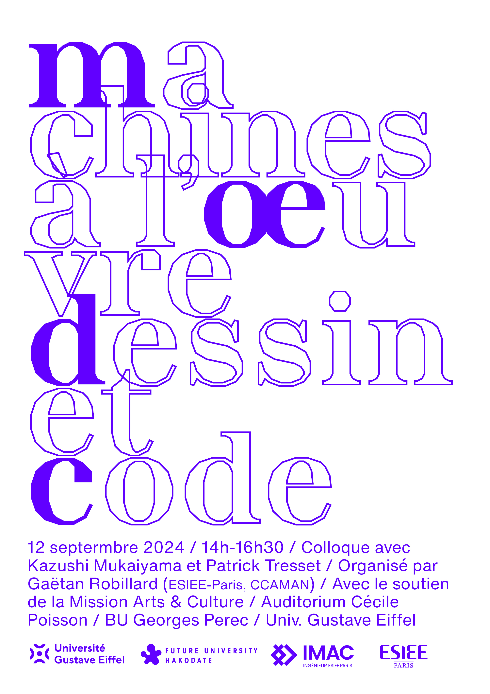

# Machines à l'œuvre. Dessin et code

Jeudi 12 septembre, 14h-16h30. Auditorium Cécile Poisson, B.U. George Perec Université Gustave Eiffel.

Adossé à l'exposition *Machine à l'œuvre*, ce colloque portera sur les rapports entre dessin, code et IA. D'un point de vue graphique, la ligne est un élément prépondérant de l'esthétique générative proposée par Max Bense ou Frieder Nake en Europe dans les années soixante. Comment à l'époque de l'IA générative cette réflexion évolue-t-elle, en particulier face aux modèles d'apprentissage profond (*deep learning*) ? Quelles nouvelles logiques et quelles pratiques sont en jeu ? Quelles en sont les limites ? Le colloque articulera ces questions par la présentation des artistes ou chercheurs Patrick Tresset et Kazushi Mukaiyama. Puis, nous ouvrirons sur une table ronde, afin de revenir sur l'histoire ou sur les avancées de l'informatique créative.

Colloque organisé par Gaëtan Robillard (ESIEE Paris, CCAMAN), avec le soutien de la Mission Arts et Culture, Université Gustave Eiffel. Session animée en langue française et anglaise.

## Programme

14h, Gaëtan Robillard, *Introduction : Dessin et code*  
14h15, Patrick Tresset, *Embodied computational technologies as an artistic medium*  
14h45, Kazushi Mukaiyama, *Using AI to understand human creativity deeply*  
15h15, Table ronde  
16h, Conclusion  
17h, Ouverture de l'exposition Machines à l'œuvre  

## Biographies

Kazushi Mukaiyama

Gaëtan Robillard

Patrick Tresset